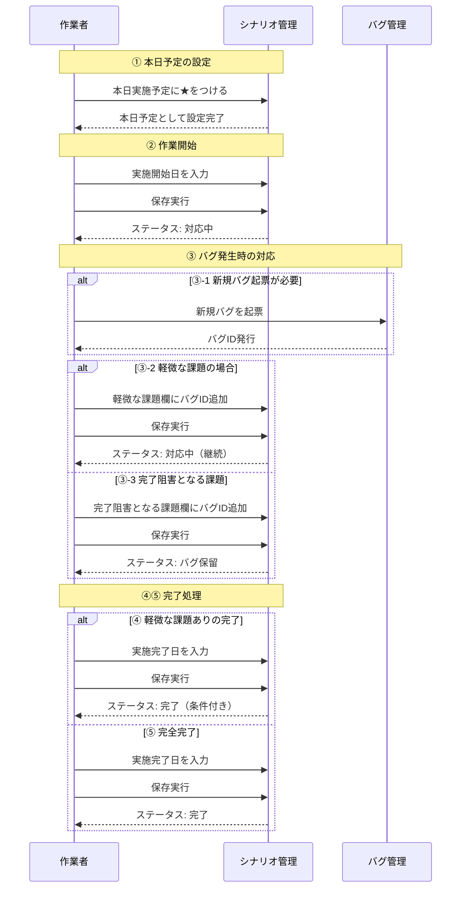
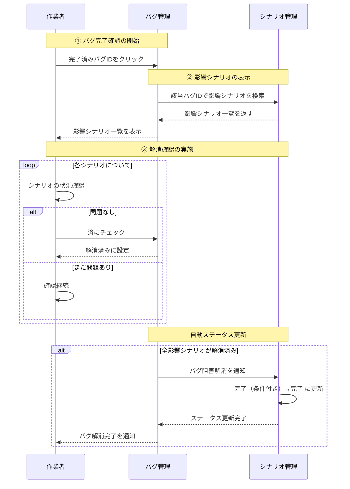
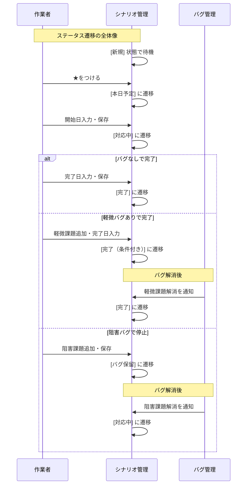

# シナリオ管理・バグ解消 作業フロー（シーケンス図）

## 📋 1. シナリオ作成状況管理のシーケンス

## 🔍 2. バグ解消確認のシーケンス

## 📈 3. 総合ステータス遷移のシーケンス

## 🎯 シーケンス図の読み方

### 参加者
- **作業者**: シナリオ作成・バグ対応を行うユーザー
- **シナリオ管理**: シナリオの状況・ステータスを管理するシステム
- **バグ管理**: バグの起票・追跡・解消を管理するシステム

### 処理の流れ
- **→**: 同期的な処理・要求
- **-->>**: 非同期的な応答・通知
- **alt/else**: 条件分岐
- **loop**: 繰り返し処理
- **Note**: 処理段階の説明

### 重要なポイント
1. **バグ発生時の適切な分類**: 軽微 vs 阻害
2. **システム間連携**: バグ解消がシナリオステータスに自動反映
3. **効率的な確認フロー**: バグIDから影響シナリオを即座に特定

---

*最終更新: 2026年5月5日*