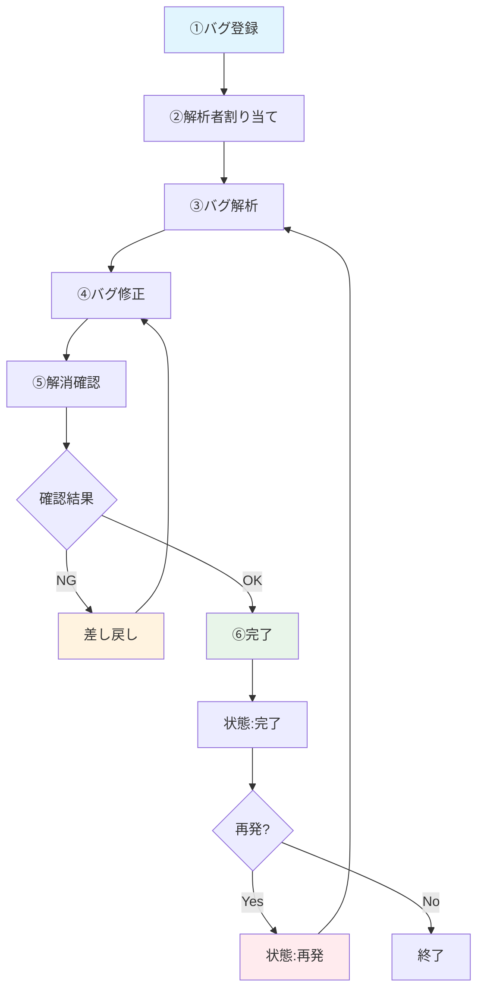
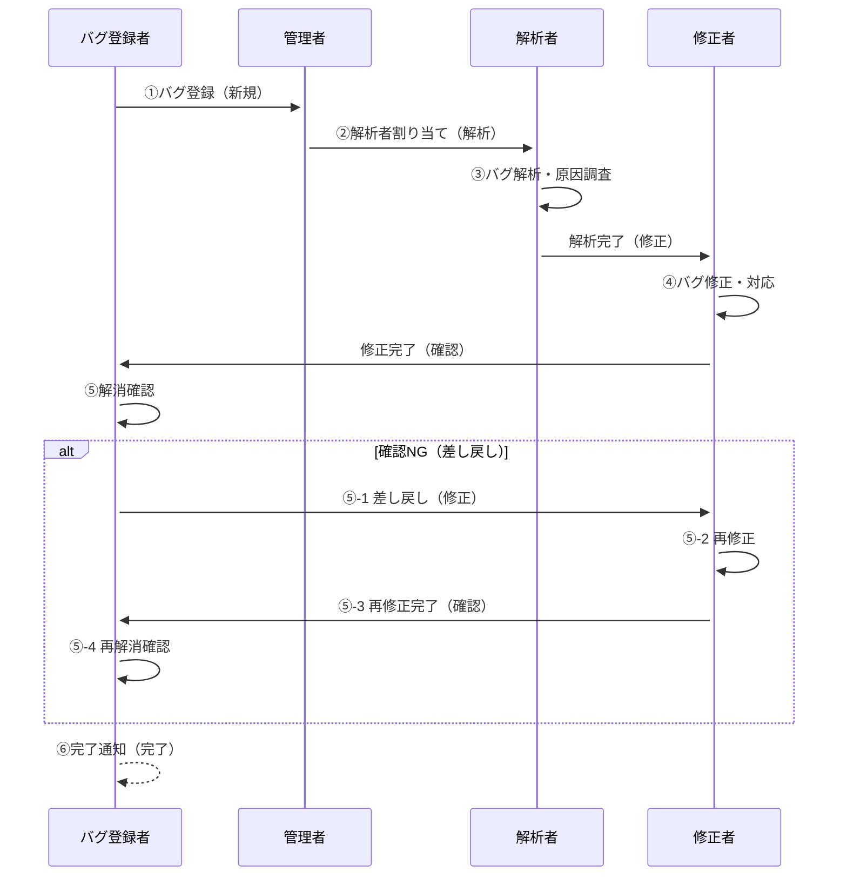

# バグ管理作業フロー

## 概要
バグ登録から完了までの運用フローシーケンス

## 登場人物
- **バグ登録者**: バグを発見・報告する担当者
- **解析者**: バグの原因を調査・分析する担当者
- **修正者**: バグを修正・対応する担当者
- **バグ登録者**: 修正内容を確認し、完了を判断する担当者

## システム状態
- 新規
- 解析
- 修正
- 確認
- 再発
- 完了

## 作業フロー

### ① バグの登録
**担当者**: バグ登録者

**作業内容**:
1. システムでバグを発見
2. バグ管理システムでバグ登録
   - タイトル入力
   - 発生日記録（m/d形式）
   - 登録者選択
   - **優先度選択（必須）**
   - 影響度選択（任意）
   - 発生起因選択
   - 起因番号入力
   - 再現率選択
   - 再現手順詳細記録
   - 期待する動作記録
   - 実際の動作記録
3. システム状態: **新規**

**成果物**:
- バグレポート（ID自動採番）
- 状態: 新規

---

### ② 解析者への割り当て
**担当者**: 管理者

**作業内容**:
1. 新規バグの一覧確認
2. 優先度・影響度を考慮した割り当て判断
3. 適切な解析者を担当者に設定
4. システム状態: **解析** に変更

**判断基準**:
- 優先度（高・中・低）
- 影響度（致命的・重大・軽微）
- 発生起因の専門性
- 解析者の作業負荷

---

### ③ バグ解析
**担当者**: 解析者

**作業内容**:
1. バグの詳細情報確認
   - 再現手順の実行
   - 発生条件の特定
   - 影響範囲の調査
2. 原因調査・分析
   - コード調査
   - 環境要因確認
   - 関連システム確認
3. 解析結果をシステムに記録
   - 原因の詳細記録
   - 影響範囲の設定（チェックボックス表）
   - 解析完了チェック
4. システム状態: **修正** に変更

**成果物**:
- 原因分析レポート
- 影響範囲マップ
- 状態: 修正

---

### ④ バグ修正
**担当者**: 修正者

**作業内容**:
1. 解析結果の確認
   - 原因の理解
   - 影響範囲の把握
2. 修正方針の決定
3. コード修正・設定変更
4. 修正内容をシステムに記録
   - 対応内容の詳細記録
   - 修正バージョン記録
   - 修正完了のマーク（影響範囲別）
   - 対応完了チェック
5. システム状態: **確認** に変更

**成果物**:
- 修正済みコード/設定
- 対応内容レポート
- 修正バージョン
- 状態: 確認

---

### ⑤ 解消確認（差し戻し）
**担当者**: バグ登録者

**作業内容**:
1. 修正内容の確認
   - 修正バージョンでの動作確認
   - 再現手順の再実行
   - 期待する動作との比較
2. **確認結果: NG**
   - 問題が解決していない場合
   - 新たな問題が発生した場合
   - 修正内容が不十分な場合
3. 差し戻し処理
   - 確認内容の記録
   - 差し戻し理由の明記
   - 差し戻しチェック
4. システム状態: **修正** に戻す

**判断基準**:
- 元の問題が解決されているか
- 新たな問題が発生していないか
- 期待する動作通りに動作するか

**次のアクション**: ④バグ修正に戻る

---

### ⑥ 解消確認（完了）
**担当者**: バグ登録者

**作業内容**:
1. 修正内容の確認
   - 修正バージョンでの動作確認
   - 再現手順の再実行
   - 期待する動作との比較
2. **確認結果: OK**
   - 問題が完全に解決された
   - 期待する動作通りに動作する
   - 副作用がない
3. 完了処理
   - 確認内容の記録
   - 確認完了チェック
4. システム状態: **完了** に変更

**成果物**:
- 確認完了レポート
- 状態: 完了

---

## 特別なケース

### 再発対応
**発生条件**: 完了したバグが再度発生した場合

**作業フロー**:
1. システム状態: **再発** に設定
2. ③バグ解析から再開
3. より詳細な原因調査を実施
4. 根本原因の特定と対応

### 緊急対応
**発生条件**: 優先度が「高（最優先）」または影響度が「致命的」の場合

**特別処理**:
- 即座に解析者に割り当て
- 解析・修正・確認を並行実施
- 日次報告による進捗管理

---

## フロー図

## シーケンス図

---

## 運用ポイント

### 品質確保
- 各段階での成果物の明確化
- バグ登録者による客観的な品質チェック
- 差し戻し時の改善点明確化

### 効率化
- 優先度・影響度に基づく適切な工数配分
- 並行作業可能な部分の識別
- 定期的な進捗確認

### トレーサビリティ
- 各段階での作業内容記録
- 状態変更の履歴管理
- 再発時の過去情報参照

### コミュニケーション
- 担当者間の円滑な引き継ぎ
- 状態変更時の関係者通知
- 問題発生時の迅速な情報共有