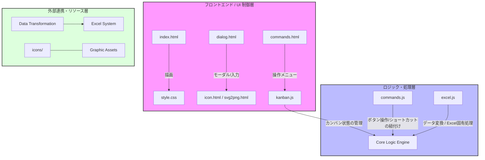
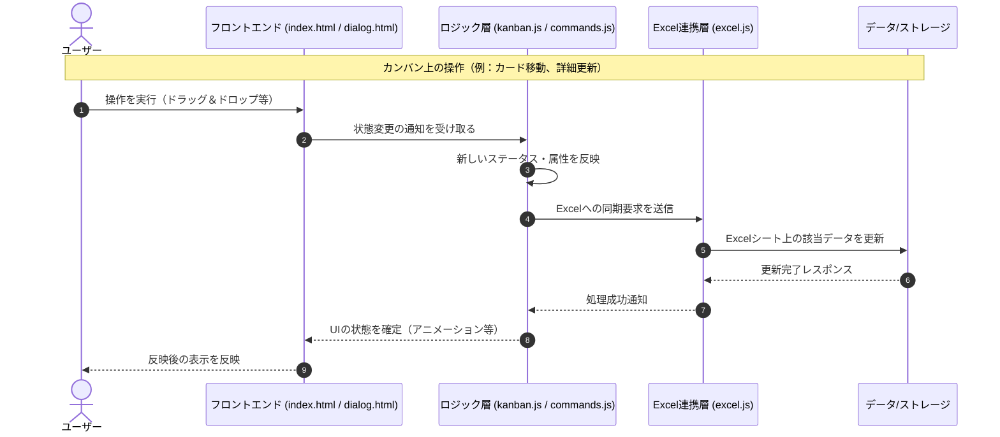

# プロジェクト概要：Excel連携カンバンシステム (Add-in)

本プロジェクトは、Excelとの高度な連携機能を備えたカンバン（Kanban）管理アドインです。単一のタスク管理ツールとしてだけでなく、Excelをデータソースまたはメイン操作画面として活用するための仕組みを備えています。

## 1. 主要機能の要件
- **カンバン管理**: タスクをカードとして可視化し、ステータスに基づいた動的な移動と管理を行います。
- **Excel連携**: `excel.js` を介して、Excel上のデータとカンバン情報を同期・変換する機能を備えています。
- **リッチなUI/UX**: `icon.html` や `svg2png.html` 等を用いて、SVGからPNGへの動的変換を含む視覚的に優れたインターフェースを提供します。
- **拡張可能なコマンド体系**: `commands.js` を通じて、ユーザー操作（ボタンやショートカット）をシステム内の処理に紐付けます。

## 2. システム構造 (Architecture)



### 仕組みの解説：
1.  **フロントエンド層**: `index.html` や `dialog.html` がユーザーへの視覚的なインターフェースを提供。特に画像処理関連のファイルが、動的なアイコン生成を支えています。
2.  **ロジック層**: `kanban.js` が核心となるロジックを担当し、`commands.js` と `excel.js` がそれぞれ「操作の橋渡し」と「データの橋渡し」を担います。
3.  **データ/リソース層**: Excelとの密接な同期により、実用的なプロジェクト管理を実現しています。


# 概念図

## システム構造 (Architecture)
本システムは、ユーザーインターフェース(UI)、ビジネスロジック、およびデータ連携の3つの層で構成されています。


## 操作フロー (Sequence Diagram)
カンバン上でのアクションから、Excelへのデータ反映に至るまでの主要な流れを定義します。



### コンポーネントの役割解説：
1. **フロントエンド層**: HTML/CSSによる視覚的要素と、ユーザーの入力を受け取るインターフェースを提供。
2. **ロジック層**: カンバンの状態管理、ボタン操作の解析、Excelとのやり取りの橋渡しを行う。
3. **データ連携層**: 実際のExcelファイルへの書き込みや、外部データの変換処理を担当。
```